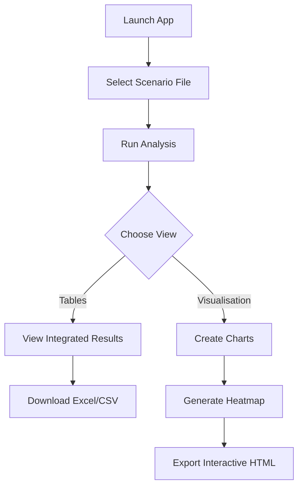

# Hydrogen-Reduced Steel Input-Output Analysis System

A comprehensive Input-Output (I-O) Table analysis platform for analyzing economic and employment impacts of hydrogen-reduced steel technologies. This system integrates conventional I-O table analysis with hydrogen scenario modeling to assess the transition from coal-based to hydrogen-based steel production.

## 🌟 Key Features

### **Multi-Table Analysis**
- **Conventional I-O Tables**: Korean I-O Table 2020 & 2023 analysis (380+ sectors)
- **Hydrogen Table Analysis**: Specialized hydrogen scenario modeling (H2S, H2T, etc.)
- **Integrated Analysis**: Combined assessment of conventional and hydrogen scenarios
- **Scenario Batch Processing**: Automated analysis across multiple years and scenarios

### **Comprehensive Impact Assessment**
- **Economic Effects**: 6 coefficient types (direct, indirect production, import, value-added)
- **Employment Effects**: Job creation and direct employment across 165 sub-sectors
- **Hydrogen Effects**: Production and value-added coefficients for hydrogen scenarios
- **Multi-Year Analysis**: Time-series analysis from 2026 to 2050

### **Advanced Visualizations**
- **Interactive Plotly Charts**: Yearly trends, sector comparisons, heatmaps
- **Code_H Heatmaps**: Top sector impacts by product category with 3-line labels
- **Sector Ranking**: Top 10 sector analysis with impact magnitude visualization
- **Customizable Views**: Adjustable parameters for top N sectors, years, and effect types

### **Professional GUI Interface**
- **Streamlit Web Application**: User-friendly interface with tabbed navigation
- **Real-time Analysis**: Instant calculation and visualization updates
- **Scenario File Selection**: Choose between different scenario configurations
- **Export Capabilities**: Excel and CSV downloads with metadata

## 📦 Installation

### Requirements

```bash
pip install pandas streamlit openpyxl plotly seaborn matplotlib numpy
```

### Python Version
- Python 3.8 or higher recommended

## 🚀 Quick Start

### Launch Web Application
```bash
streamlit run main_gui.py
```

The application will open in your default web browser at `http://localhost:8501`

### Command Line Analysis
```bash
python main.py
```

## 📊 Application Structure

### Main Navigation

The application has three main modules accessible from the sidebar:

#### 1. **📋 Scenarios**
- View and select scenario files
- Preview scenario data
- Manage scenario configurations

#### 2. **📊 Tables** (5 Tabs)
- **🚀 Run Analysis**: Select scenario file and execute batch analysis
- **🔗 Integrated**: Summary tables combining all effect types (2026, 2030, 2040, 2050)
- **⚡ H2**: Hydrogen table analysis results
- **📊 Total**: Aggregated summary across all analyses
- **👤 Individual**: Detailed individual sector analysis

#### 3. **📈 Visualisation** (3 Tabs)
- **📈 Yearly Trends**: Time-series visualization of impacts
  - IO Table trends (1610, 4506, 1610&4506)
  - Hydrogen trends (H2S, H2T, H2S&H2T)
- **🗺️ Sector Maps**: Top 10 sector impact analysis
- **🔥 Code_H Heatmap**: Interactive heatmap by product category
  - Ranked by absolute values
  - Colored by true values (red=positive, blue=negative)
  - Top N sectors per category (configurable 5-20)

## 📁 Data Files

### Scenario Files (`data/`)
- **`scenarios_1_2020.xlsx`**: 2020 baseline scenarios
- **`scenarios_1_2023.xlsx`**: 2023 updated scenarios (recommended)

### Core Data Files
- **`iotable_2020.xlsx`**: Korean I-O Table 2020 (11 sheets)
- **`iotable_2023.xlsx`**: Korean I-O Table 2023 (latest)
- **`hydrogentable.xlsx`**: Hydrogen scenario coefficients

### Scenario File Structure

Scenario Excel files contain:
- **Columns**: `input`, `sector`, and year columns (2026, 2027, ..., 2050)
- **input**: Data source ('iotable' or 'hydrogen')
- **sector**: Sector code ('1610', '4506', 'H2S', 'H2T', etc.)
- **Year columns**: Demand change values for each year

Example:
```
input      | sector | 2026    | 2027    | ... | 2050
-----------|--------|---------|---------|-----|----------
iotable    | 1610   | 1000000 | 1050000 | ... | 2000000
iotable    | 4506   | 500000  | 525000  | ... | 1000000
hydrogen   | H2S    | 100000  | 150000  | ... | 500000
hydrogen   | H2T    | 80000   | 120000  | ... | 400000
```

## 🔬 Analysis Types

### Economic Coefficients (I-O Table)

| Effect Type | Description | Unit | Scenarios |
|-------------|-------------|------|-----------|
| `indirect_prod` | Indirect Production (Leontief) | Million Won | 1610 + 4506 |
| `indirect_import` | Indirect Import | Million Won | 1610 + 4506 |
| `value_added` | Value Added (GDP) | Million Won | 1610 + 4506 |

### Hydrogen Coefficients

| Effect Type | Description | Unit | Scenarios |
|-------------|-------------|------|-----------|
| `productioncoeff` | Production Inducing Effect | Million Won | H2S + H2T |
| `valueaddedcoeff` | Value Added Effect | Million Won | H2S + H2T |

### Employment Coefficients

| Effect Type | Description | Unit | Scenarios |
|-------------|-------------|------|-----------|
| `jobcoeff` | Total Job Creation | Persons | All (IO + H2) |
| `directemploycoeff` | Direct Employment | Persons | All (IO + H2) |

## 🎨 Visualization Features

### Code_H Heatmap

The Code_H heatmap provides a comprehensive view of sector impacts:

**Features**:
- **X-axis**: Product_H categories (Korean product names)
- **Y-axis**: Ranking (#1 to #10 or custom top N)
- **Cell Colors**: Impact values (diverging colormap)
  - 🔴 Red = Positive impact
  - 🔵 Blue = Negative impact  
  - ⚪ White = Near zero
- **Cell Text**: Sector names split into 3 lines (very small font)
- **Ranking Method**: By absolute values (magnitude)
- **Coloring Method**: By true values (shows direction)

**Interactive Features**:
- Hover for detailed information
- Zoom and pan capabilities
- Download as PNG or HTML
- Responsive layout

### Yearly Trends

Track how impacts evolve over time:
- Multiple scenarios on one chart
- Customizable effect types
- Separate IO and Hydrogen trend analysis
- Clear unit labeling (Billion Won vs Persons)

## 💾 Export Options

### Available Formats

1. **Excel (.xlsx)**
   - Multiple sheets per file
   - One sheet per effect type
   - Metadata included (analysis parameters, dates)
   - Formatted for easy reading

2. **CSV (.csv)**
   - UTF-8 with BOM encoding (Korean text support)
   - Fallback when Excel not available
   - Compatible with Excel and Google Sheets

3. **HTML (.html)**
   - Interactive Plotly charts
   - Fully functional offline
   - Shareable visualizations

### Export Contents

- **Summary Tables**: Aggregated impacts by year
- **Detailed Sector Data**: Individual sector impacts
- **Visualization Files**: Interactive charts and heatmaps
- **Complete Analysis**: All effect types in one file

## 🏗️ System Architecture

### Core Modules

```
libs/
├── io_analyzer.py          # I-O Table analysis engine (583 lines)
├── hydrogen_analyzer.py    # Hydrogen scenario analysis (242 lines)
├── scenario_analyzer.py    # Batch scenario processor (995 lines)
└── visualisation.py        # Plotly/Matplotlib charts (1061 lines)
```

### Main Applications

```
main_gui.py                 # Streamlit web interface (1497 lines)
main.py                     # CLI interface (legacy)
```

### Class Architecture

```python
IOTableAnalyzer
├── Load I-O tables (2020/2023)
├── Calculate economic effects
└── Export results

HydrogenTableAnalyzer  
├── Load hydrogen tables
├── Calculate H2 scenarios
└── Scenario-specific analysis

ScenarioAnalyzer
├── Batch process multiple scenarios
├── Aggregate results by year
├── Integrate sectors (1610+4506, H2S+H2T)
└── Generate summary tables

Visualization
├── Create yearly trend charts
├── Generate Code_H heatmaps
├── Plot top sector rankings
└── Export interactive HTML
```

## 📖 User Guide

### Step 1: Load Scenario File

1. Navigate to **Tables** → **🚀 Run Analysis**
2. Select scenario file (e.g., `scenarios_1_2023.xlsx`)
3. Preview file contents (optional)
4. Click **"🚀 Run Complete Scenario Analysis"**
5. Wait for analysis to complete (~1-2 minutes)

**Check sidebar**: You should see ✅ with the loaded filename

### Step 2: View Integrated Results

1. Go to **Tables** → **🔗 Integrated** tab
2. Browse tabs for different effect types
3. View summary tables (2026, 2030, 2040, 2050)
4. Explore detailed sector impacts
5. Download data as needed

### Step 3: Generate Visualizations

#### Yearly Trends
1. Go to **Visualisation** → **📈 Yearly Trends**
2. Choose IO or Hydrogen table
3. Select effect type and scenarios
4. Click **"Generate"**

#### Code_H Heatmap
1. Go to **Visualisation** → **🔥 Code_H Heatmap**
2. Select:
   - Effect type (e.g., indirect_prod)
   - Year (2026, 2030, 2040, or 2050)
   - Top N sectors (5-20)
3. Click **"🎨 Generate Heatmap"**
4. View interactive heatmap with scenario information
5. Hover over cells for details

## 🔧 Technical Specifications

### Data Processing

- **Matrix Operations**: Vectorized pandas operations
- **Memory Management**: Efficient handling of 380x380 matrices
- **Caching**: Streamlit @st.cache_data for analyzer instances
- **Session State**: Persistent results across tab navigation

### Code_H Mapping System

The system uses hierarchical product classification:
- **Basic Sectors**: 411 detailed sectors (e.g., 2711: Pig iron)
- **Code_H**: Aggregated product codes (e.g., 241: Steel)
- **Product_H**: Product category names (e.g., 철강: Steel products)

**Mapping Flow**:
```
Basic Sector (2711) → Code_H (241) → Product_H (철강)
```

### Employment Sub-Sector Structure

- **411 Basic Sectors** → **165 Employment Sub-Sectors**
- Korean names for all sub-sectors
- Hierarchical aggregation for precise job impact estimation

## 📊 Sample Analysis Workflow

### Scenario: Assess Impact of Hydrogen Steel Transition (2030)

1. **Load Data**:
   ```
   File: scenarios_1_2023.xlsx
   Scenarios: 1610 (coal), 4506 (renewable), H2S, H2T
   Year: 2030
   ```

2. **Run Analysis**:
   - Tables → Run Analysis → Select file → Run

3. **View Economic Impact**:
   - Tables → Integrated → indirect_prod tab
   - Check 2030 column
   - See which sectors benefit/decline

4. **View Employment Impact**:
   - Tables → Integrated → jobcoeff tab
   - Check job creation by sector
   - Includes both IO and H2 scenarios

5. **Visualize Top Sectors**:
   - Visualisation → Code_H Heatmap
   - Effect: indirect_prod, Year: 2030
   - See top 10 sectors per product category

6. **Track Trends**:
   - Visualisation → Yearly Trends
   - Compare 1610 vs 4506 vs 1610&4506
   - Observe transition pathway

## 🎯 Use Cases

### Policy Analysis
- **Green Transition**: Assess economic impact of moving from coal (1610) to renewables (4506)
- **Hydrogen Strategy**: Evaluate hydrogen storage (H2S) and transport (H2T) scenarios
- **Employment Planning**: Identify job creation opportunities and displacement risks
- **Regional Development**: Analyze sector-specific impacts across product categories

### Research Applications
- **Supply Chain Analysis**: Track ripple effects through integrated sectors
- **Technology Assessment**: Compare conventional vs hydrogen steel production
- **Economic Modeling**: Multi-year scenario analysis with customizable parameters
- **Data Visualization**: Publication-ready charts and heatmaps

### Business Intelligence
- **Investment Planning**: Identify high-impact sectors for strategic investment
- **Risk Assessment**: Evaluate sector vulnerabilities in energy transition
- **Market Analysis**: Understand inter-sector dependencies and opportunities
- **Reporting**: Generate professional reports with integrated data and visualizations

## 🔍 Key Improvements Over Previous Version

### Enhanced Functionality
✅ **Hydrogen Integration**: Full hydrogen scenario analysis capabilities
✅ **Batch Processing**: Automated multi-scenario, multi-year analysis
✅ **Code_H Heatmaps**: New visualization type for product category analysis
✅ **Scenario Selection**: User-selectable scenario files (2020 vs 2023)
✅ **Integrated Tables**: Unified view of all effect types and years

### UI/UX Improvements  
✅ **Tabbed Interface**: Organized navigation (Scenarios, Tables, Visualisation)
✅ **File Indicators**: Clear display of currently loaded scenario file
✅ **Interactive Charts**: Fully interactive Plotly visualizations
✅ **Multi-line Labels**: Improved readability with 3-line sector names
✅ **Error Messages**: Helpful guidance when data is missing

### Technical Enhancements
✅ **Session Management**: Persistent results across tab changes
✅ **Performance**: Cached analyzers and optimized data processing
✅ **Modular Code**: Reusable helper functions (66% code reduction potential)
✅ **Consistent Units**: Proper handling of Billion Won vs Persons
✅ **H2 Sector Support**: Fixed Code_H mapping for hydrogen scenarios

## 📋 File Structure

```
steel_iotable/
├── main_gui.py                     # Main Streamlit application (1497 lines)
├── main.py                         # CLI interface (legacy)
│
├── libs/                           # Core library modules
│   ├── io_analyzer.py              # I-O Table analysis (583 lines)
│   ├── hydrogen_analyzer.py        # Hydrogen scenario analysis (242 lines)
│   ├── scenario_analyzer.py        # Batch scenario processor (995 lines)
│   ├── visualisation.py            # Visualization engine (1061 lines)
│   └── demandchange.py             # Demand change utilities
│
├── data/                           # Data files
│   ├── scenarios_1_2020.xlsx       # 2020 baseline scenarios
│   ├── scenarios_1_2023.xlsx       # 2023 updated scenarios ⭐
│   ├── iotable_2020.xlsx           # Korean I-O Table 2020
│   ├── iotable_2023.xlsx           # Korean I-O Table 2023 ⭐
│   └── hydrogentable.xlsx          # Hydrogen coefficients
│
├── output/                         # Analysis results
│   ├── combined_scenario_data.xlsx
│   ├── total_impact_per_year.xlsx
│   └── scenario_analyzer produced/
│
├── archive/                        # Legacy code and documentation
└── README.md                       # This file
```

## 🎓 Analysis Methodology

### Economic Impact Formula

```
Impact = Coefficient Matrix × Demand Change Vector

For sector i:
Impact_i = Σ(C_ij × ΔD_j)

Where:
- C_ij: Coefficient from sector j to sector i
- ΔD_j: Demand change in sector j
```

### Employment Impact Formula

```
Jobs = Employment Coefficient Matrix × Demand Change

For sub-sector i:
Jobs_i = E_ij × ΔD_j

Where:
- E_ij: Job coefficient (jobs per billion won)
- ΔD_j: Demand change in basic sector j (mapped to sub-sector)
```

### Aggregation Methods

**Integrated Sectors (1610+4506)**:
```python
# Combine impacts from coal (1610) and renewable (4506) sectors
integrated_impact = impact_1610 + impact_4506
```

**Hydrogen Integration (H2S+H2T)**:
```python
# Combine hydrogen storage and transport scenarios
integrated_h2 = impact_H2S + impact_H2T
```

## 🎨 Code_H Heatmap Specifications

### Visual Design

- **Font Size**: 2.5pt (matplotlib) / 5pt (Plotly) - very small to prevent overlap
- **Text Layout**: All sector names split into 3 lines
- **Colormap**: RdBu_r (Red-Blue diverging)
- **Centering**: Zero-centered for positive/negative distinction
- **Line Spacing**: 1.3 for readability

### Data Processing

1. **Ranking**: Sort by absolute values (magnitude) within each Code_H
2. **Coloring**: Apply true values (preserving sign)
3. **Filtering**: Show top N sectors (default 10, max 20)
4. **Labeling**: Use Product_H names on X-axis

### Text Splitting Algorithm

```python
# All names split into 3 lines for consistency
if words >= 3:
    # Distribute evenly (e.g., 9 words → 3-3-3)
    line1, line2, line3 = distribute_words(words)
elif words == 2:
    # Two words on first two lines
    line1, line2, line3 = word1, word2, ''
else:
    # Single word on first line
    line1, line2, line3 = word, '', ''
```

## 📈 Unit Handling

### Automatic Unit Conversion

| Effect Type | Raw Unit | Display Unit | Conversion |
|-------------|----------|--------------|------------|
| Economic (indirect_prod, etc.) | Million Won | Billion Won | ÷ 1000 |
| Employment (jobcoeff, etc.) | Persons | Persons | ×1 (no conversion) |
| Hydrogen production | Million Won | Billion Won | ÷ 1000 |

**Important**: Job creation values are **NOT** divided by 1000 in yearly trends!

## 🔄 Workflow Example

### Complete Analysis Workflow



### Typical Session

1. **Startup** → App loads, shows sidebar menu
2. **File Selection** → Tables → Run Analysis → Select scenarios_1_2023.xlsx
3. **Analysis** → Click "Run Complete Analysis" (wait ~2 min)
4. **Exploration** → Navigate tabs to view different analyses
5. **Visualization** → Create heatmaps and trend charts
6. **Export** → Download results as Excel/CSV/HTML

## 🐛 Troubleshooting

### Common Issues

**Issue**: "No data available with Code_H mappings"
- **Cause**: H2 sectors don't have Code_H mappings
- **Solution**: Now fixed! System uses sector_code as fallback
- **Status**: ✅ Resolved in latest version

**Issue**: "No scenario analysis results available"  
- **Cause**: Analysis not yet run
- **Solution**: Go to Tables → Run Analysis and execute
- **Status**: Clear guidance provided in UI

**Issue**: Job creation values too large/small
- **Cause**: Incorrect unit conversion
- **Solution**: Now fixed! Job values not divided by 1000
- **Status**: ✅ Resolved in latest version

**Issue**: Sector names overlapping in heatmap
- **Cause**: Long Korean sector names in small cells
- **Solution**: 3-line splitting with very small font (2.5pt/5pt)
- **Status**: ✅ Resolved with optimized text layout

### Debug Mode

Check session state in Streamlit:
```python
# In any tab, check:
st.write(st.session_state.keys())
st.write(st.session_state.get('current_scenario_file'))
```

## 🚧 Current Limitations

- **Data Coverage**: Limited to Korean I-O Table sectors
- **Hydrogen Scenarios**: Currently 4 predefined scenarios (H2S, H2T, etc.)
- **Real-time Updates**: Requires manual scenario file updates
- **Language**: Korean sector names (no English translations)

## 🔮 Future Enhancements

### Planned Features
- [ ] English translations for international users
- [ ] More hydrogen scenarios (H2P, H2U expansion)
- [ ] Custom scenario builder in GUI
- [ ] Comparative analysis across scenario files
- [ ] Export templates for reports
- [ ] API for programmatic access
- [ ] Database backend for better performance

### Enhancement Ideas
- [ ] Regional analysis by province
- [ ] Environmental impact integration (CO2, etc.)
- [ ] Cost-benefit analysis tools
- [ ] Monte Carlo simulation for uncertainty
- [ ] Time-series forecasting

## 👥 Contributing

### How to Contribute

1. **Fork the repository**
2. **Create feature branch**: `git checkout -b feature/new-analysis`
3. **Make changes**: Follow existing code style
4. **Test thoroughly**: Ensure all tabs work correctly
5. **Submit PR**: With clear description of changes

### Code Style

- **Docstrings**: Required for all functions
- **Type Hints**: Encouraged for better IDE support
- **Comments**: Explain complex logic in Korean or English
- **Formatting**: Follow PEP 8 guidelines
- **Error Handling**: Use try-except with informative messages

## 📞 Support

### Getting Help

- **GitHub Issues**: Report bugs and request features
- **Documentation**: This README and inline code comments
- **Examples**: See visualization examples in `libs/visualisation.py`

### Reporting Issues

Include in your issue:
1. Scenario file used
2. Selected parameters (effect type, year, etc.)
3. Error message (screenshot or text)
4. Expected vs actual behavior
5. Browser and OS version (for GUI issues)

## 📜 License

MIT License - see LICENSE file for details

## 🙏 Acknowledgments

- **Data Source**: Bank of Korea (한국은행) Input-Output Tables
- **I-O Methodology**: Based on Leontief Input-Output Model
- **Visualization**: Powered by Plotly and Matplotlib
- **Web Framework**: Built with Streamlit

---

## Quick Reference Card

### Essential Commands

| Action | Command | Location |
|--------|---------|----------|
| Launch GUI | `streamlit run main_gui.py` | Terminal |
| Run Analysis | Click "🚀 Run" | Tables → Run Analysis |
| View Results | Navigate tabs | Tables → Integrated/H2/Total |
| Create Heatmap | Select params + Generate | Visualisation → Code_H Heatmap |
| Download Data | Click 📥 button | Any table view |

### Key File Locations

| Purpose | Path |
|---------|------|
| Latest scenarios | `data/scenarios_1_2023.xlsx` ⭐ |
| Latest I-O table | `data/iotable_2023.xlsx` ⭐ |
| Hydrogen data | `data/hydrogentable.xlsx` |
| Exported results | `output/` |
| Interactive charts | `libs/output/plotly_charts/` |

### Important Notes

⚠️ **Unit Awareness**: Economic values in Billion Won, Employment in Persons
⚠️ **Scenario Files**: Use scenarios_1_2023.xlsx for latest data
⚠️ **Analysis Required**: Must run analysis before viewing visualizations
⚠️ **File Selection**: Check sidebar to confirm loaded file

---

**Version**: 2.0 (Latest)  
**Last Updated**: November 2025  
**Status**: Production Ready ✅

*Built for Hydrogen-Reduced Steel Transition Analysis | Integrating I-O Economics with Green Technology Assessment*
